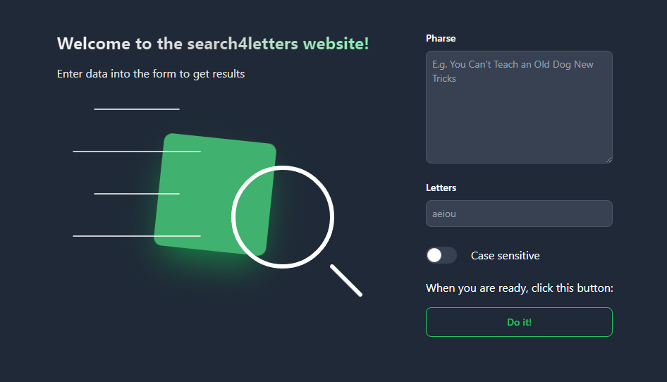
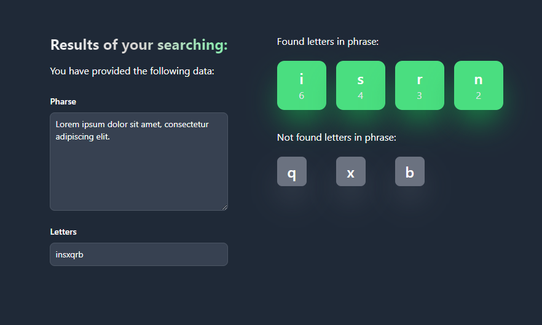
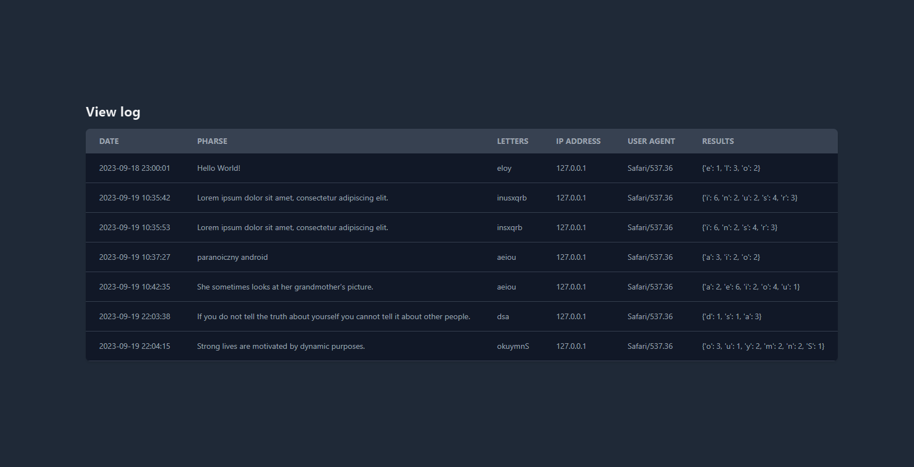

# Vsearch4Web ULTRA

It's an improved and professional version of the vsearch4web application. Allows you to search for letters in a given phrase. Additionally, you can see amouth of found letters. You can also search with case sensitive or not. The aplication uses Python, Flask, SQL, MariaDB, Flowbite, Tailwind.

## Entry page /


## Result page /search4


## View log page /viewlog


## Login page /login and /logout
There is also a login page and a logout page. That is giving you access to the view log page.

## How to run locally
Open the project and type:
```
py main.py
```

## Requiments
Please install the following packages:
* flask
* mysql.connector